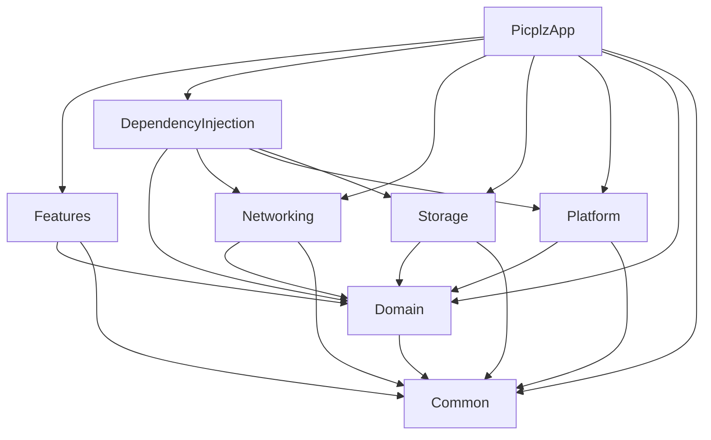

# 📸 Picplz iOS 프로젝트 소개서

이 문서는 Picplz iOS 프로젝트의 아키텍처, 모듈 구조 및 개발 컨벤션을 설명합니다.

## 🛠 기술 스택 (Tech Stack)

- **Language**: Swift 6
- **UI Framework**: SwiftUI
- **Architecture**: Modular Architecture + Clean Architecture
- **State Management**:
  [The Composable Architecture (TCA)](https://github.com/pointfreeco/swift-composable-architecture)
- **Dependency Injection**:
  [swift-dependencies](https://github.com/pointfreeco/swift-dependencies)
- **Project Management**: [Tuist](https://tuist.io/)
- **Tooling**: mise (개발 도구 버전 관리)

---

## 🏗 전체 아키텍처 (Architecture Overview)

이 프로젝트는 **Clean Architecture** 원칙을 따르며, **Tuist**를 이용해 다중
모듈(Multi-module)로 분리되어 있습니다. UI 레이어는 **TCA**를 사용하여 단방향
데이터 흐름(Unidirectional Data Flow)을 유지합니다.

### 📊 모듈 의존성 그래프 (Dependency Graph)



### 📐 모듈별 역할 및 책임 (Module Responsibilities)

| 모듈명                  | 역할                            | 주요 구성 요소                           |
| :---------------------- | :------------------------------ | :--------------------------------------- |
| **PicplzApp**           | 앱의 진입점 및 루트 설정        | `AppView`, `AppFeature`, 초기화 로직     |
| **Features**            | UI 및 화면별 비즈니스 로직      | TCA Reducers, Views, DesignSystem        |
| **Domain**              | 순수 비즈니스 로직 (Core)       | Entities, UseCases, Repository Protocols |
| **DependencyInjection** | DI 연결 통로 (Live 구현체 주입) | DependencyKey+Live 구현                  |
| **Networking**          | API 통신 로직                   | API Clients, Repositories, DTOs          |
| **Storage**             | 데이터 영속성 관리              | KeychainStorage, UserDefaults            |
| **Platform**            | iOS 플랫폼 종속 서비스          | LocationManager, Camera, Photos          |
| **Common**              | 전역 유틸리티 및 헬퍼           | Logger, BundleHelper, Extensions         |

---

## 🔄 데이터 흐름 (Data Flow)

프로젝트의 데이터 흐름은 일반적으로 다음과 같은 경로를 따릅니다:

1. **View**: 사용자의 액션이 발생하면 TCA `Store`로 `Action`을 보냅니다.
2. **Feature (Reducer)**: `Action`을 받아 필요한 `UseCase`를 호출합니다.
3. **UseCase (Domain)**: 비즈니스 로직을 수행하며, 추상화된
   `Repository Protocol`을 통해 데이터를 요청합니다.
4. **Repository (Networking/Storage)**: 실제 네트워크 통신이나 DB 접근을
   수행하고 데이터를 반환합니다.
5. **Feature (Reducer)**: 결과값을 받아 `State`를 업데이트합니다.
6. **View**: 업데이트된 `State`에 따라 UI가 자동으로 갱신됩니다.

---

## 💉 의존성 주입 (Dependency Injection)

TCA의 `Dependencies` 라이브러리를 사용합니다.

- **Interface**: `Domain` 모듈에 Protocol이나 UseCase 구조체가 정의되어
  있습니다.
- **Live Implementation**: `Networking`, `Storage`, `Platform` 등에서 실제
  로직을 구현합니다.
- **Registration**: `DependencyInjection` 모듈에서
  `@retroactive DependencyKey`를 사용하여 `liveValue`를 등록합니다. 이를 통해 각
  레이어간의 강한 결합을 피하고 테스트 가능성을 높입니다.

**예시 (UseCase 호출):**

```swift
@Dependency(\.signInUseCase) var signInUseCase
```

---

## 🗓 프로젝트 타임라인 및 주요 마일스톤 (Key Milestones)

프로젝트의 주요 개발 이정표와 핵심 구현 사항입니다:

1. **초기 프로젝트 구조 및 디자인 시스템 수립**
   - Tuist를 이용한 멀티 모듈 아키텍처(Features, Domain, Networking 등) 기반
     마련.
   - Color 및 Typography를 포함한 기초 디자인 시스템 구축 및 테마 적용.
2. **온보딩 및 사용자 인증 (Kakao Login) 구현**
   - 스플래시 화면 및 온보딩 페이지 인디케이터 구현.
   - Kakao SDK 연동을 통한 소셜 로그인 및 토큰 관리(Keychain) 기능 개발.
   - Moya Plugin을 활용한 자동 토큰 리프레시 시스템 구축.
3. **회원가입 플로우 (고객 및 작가 전용) 개발**
   - 닉네임 중복 검사, 프로필 이미지 업로드, 역할(Role) 선택 기능.
   - 작가 전용 회원가입: 위치 권한 요청, 활동 지역 선택(Area API), 촬영 장비 및
     분위기 선택 등 고도화된 입력 폼 구현.
4. **도메인 기반 리팩토링 및 고도화**
   - `PhotographerEquipment` 등 엔티티의 도메인 레이어 이동 및 비즈니스 로직
     중심 리팩토링.
   - 네트워크 레이어 가독성 및 유지보수성 개선을 위한 `Networking` 모듈
     리팩토링.
5. **의존성 주입(DI) 아키텍처 및 모듈 의존성 최적화**
   - `DependencyInjection` 전용 모듈 신설로 레이어 간 결합도 제거 (Clean
     Architecture 준수).
   - `SharedSupports` 제거 및 동적 링크(Dynamic Link) 최적화를 통한 빌드 성능
     개선.

---

## 📂 주요 디렉토리 구조

```text
Projects/
├── PicplzApp/           # 앱 메인 타겟
├── Features/            # UI 및 Feature (Splash, Onboarding, Main 등)
│   ├── Sources/DesignSystem/  # 공통 컴포넌트, 컬러, 타이포그래피
│   └── Sources/Main/          # 주요 화면별 Feature 및 View
├── Domain/              # 비즈니스 로직 (Entities, UseCases)
├── Networking/          # API 통신 (Moya/URLSession 등)
├── Storage/             # 로컬 데이터 (Keychain, UserDefaults)
├── Platform/            # 플랫폼 서비스 (Location, Bluetooth 등)
├── DependencyInjection/ # DI 실체 구현체 연결부
└── Common/              # 유틸리티 (Logger 등)
```

---

## 🚀 시작하기 (Getting Started)

1. **개발 도구 설치**: `mise install` (Tuist 등 필수 도구 설치)
2. **프로젝트 생성**: `tuist install` 후 `tuist generate`
3. **워크스페이스 열기**: 생성된 `Picplz.xcworkspace` 파일을 Xcode에서 실행
