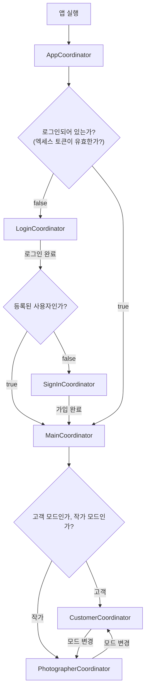

# 전체 코디네이터 플로우

```mermaid
graph TD
	CheckLogin@{ shape: diamond, label: "로그인되어 있는가?\n(엑세스 토큰이 유효한가?)" }
	CheckSignedIn@{ shape: diamond, label: "등록된 사용자인가?" }
	CheckMode@{ shape: diamond, label: "고객 모드인가, 작가 모드인가?" }
	
	EntryPotint[앱 실행] --> AppCoordinator
	AppCoordinator --> CheckLogin
	CheckLogin -- false --> LoginCoordinator
	LoginCoordinator -- 로그인 완료 --> CheckSignedIn
	CheckSignedIn -- true --> MainCoordinator
	CheckSignedIn -- false --> SignInCoordinator
	SignInCoordinator -- 가입 완료 --> MainCoordinator
	
	CheckLogin -- true --> MainCoordinator
	MainCoordinator --> CheckMode
	
  CheckMode -- 고객 --> CustomerCoordinator
	CheckMode -- 작가 --> PhotographerCoordinator
	
	CustomerCoordinator -- 모드 변경 --> PhotographerCoordinator
	PhotographerCoordinator -- 모드 변경 --> CustomerCoordinator
```
